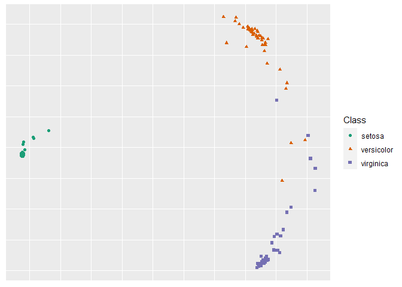
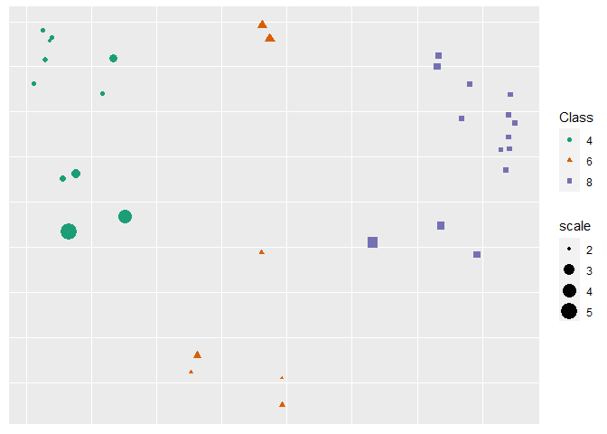

README.rmd
================
Jake S. Rhodes
4/17/2023

# RF-GAP

## Random Forest Geometry- and Accuracy-Preserving proximities

This is the official R code repository for the paper “Random Forest-
Geometry- and Accuracy-Preserving Proximities”
(<https://ieeexplore.ieee.org/document/10089875>). In the paper we show
that random forest (RF) predictions can be exactly determined by using
RF-GAP proximities as weights in a weighted-sum regressor or
weighted-majority vote classifier. This repo provides the base code to
generate the various proximity definitions described in the paper.

A Python implementation can be found here: https://github.com/jakerhodes/RF-GAP-Python.

## Package Installation

The devtools library is required for installation. to install, run the
following code:

``` r
library(devtools)
install_github('jakerhodes/RF-GAP-R')
```

## Generate RF-GAP proximities:

Random forests are capable of making predictions on both continuous and
categorical response variables for regression and classification,
respectively. Additionally, random forests handle mixed feature
variables, that is, predictor variables may be either numeric or
categorical and since the partitioning decisions are rank-based,
numerical predictor variables do not need to be normalized or
standardized as is typical in other machine learning contexts. Thus, the
construction of random forest-based proximities does not require the
same preprocessing steps as may be needed for other ML processes. This
simplifies the use of random forests and thus, for our purposes, the
generation of random forest proximities.

Let $x$ be a dataframe or matrix object with labels $y$. Here $y$ must
be numeric (for a regression forest) or a factor type (for a
classification task). If y is a character vector it will be coerced to
be a factor type. To generate the proximities, we use the
$get\\_proximities$ function. The user may use a pre-trained random
forest to construct the proximities, which has the benefit of a direct
comparison of proximity types, or to train when calling
$get\\_proximities$.

``` r
library(rfgap)

# Defining the data and labels
x <- iris[, 1:4]
y <- iris[, 5]

# Generating the proximities
prox <- get_proximities(x, y)
```

This is the simplest way to generate proximities. Here we simply call
$get\\_proximities$ using the dataframe $x$ and labels $y$ as inputs. By
default, RF-GAP proximities are constructed. The argument \$type allows
the user to select the type of proximities to be constructed, the
package currently supports “original”, “oob”, and “rfgap”.

The user may train a random forest prior to calling $get\\_proximities$.
In this case, the user must train the $ranger$ forest with the options
$keep.inbag$ and $write.forest$ set to $TRUE$. Using a pre-trained
forest allows the user to fairly compare different proximity types
without the need of retraining a forest each time.

    library(rfgap)

    # Defining the data and labels
    x <- iris[, -5]
    y <- iris[, 5]

    # Training the random forest
    rf <- ranger(x = x, y = y, keep.inbag = TRUE, write.forest = TRUE, seed = 42)

    # Constructing three sets of proximities
    proximities_rfgap <- get_proximities(x, rf = rf,
                                         type = 'rfgap')
                                         
    proximities_oob   <- get_proximities(x, rf = rf,
                                         type = 'oob')
                                         
    proximities_orig  <- get_proximities(x, rf = rf, 
                                         type = 'original')

$get\\_proximities$ has the additional option for the user to supply a
test set. Including the test set will extend the proximities to the test
observations. This is done by using the argument $x\\_test$. The
returned proximity matrix will have $n\\_train + n\\_test$ rows and
columns. The returned proximity matrix is an S3 object of type
$rf\\_proximities$. This object type has additional methods associated
with it for making predictions, producing visualizations, detecting
outliers, and imputing missing data.

## Create 2-dimensional MDS embedding using RF-GAP proximities and plot

We apply these random forest distances,
$d(x_i, x_j) = \sqrt{1 - prox(x_i, x_j)}$ to multidimensional scaling
using the function $rf\\_mds$. To use this function, the user may choose
to supply a precomputed proximity matrix, a trained $ranger$ object, or
just the dataframe $x$ with labels $y$ ($x$ is required). If a proximity
matrix is not supplied, the user may choose the proximity type (default
is RF-GAP). Two types of MDS may be run; metric MDS using the $cmdscale$
function from the $stats$ package, and non-metric MDS using the $isoMDS$
function from the $MASS$ packages. The number of dimensions can be
selected using the $n\\_dim$ argument (default is 2). The generic $plot$
function may be used to generate a scatterplot of the MDS embeddings
based on the $ggplot2$. If the labels, $y$, are supplied, the points
will be colored and shaped according to class if $y$ is of factor type,
or just colored according to scale if $y$ is numeric.

``` r
x <- iris[, 1:4]
y <- iris[, 5]
mds <- rf_mds(x, y, type = 'rfgap')
```

    ## initial  value 15.535851 
    ## iter   5 value 8.447411
    ## iter  10 value 7.959971
    ## final  value 7.942943 
    ## converged

``` r
plot(mds, y)
```

<!-- -->

We also provide the means of imputing missing data and detecting
outliers.

## Impute missing data

The $rfgap$ package provides a simple function to run random forest
imputation. It is assumed that the missing data takes the form $NA$. The
function $rf\\_impute$ requires the dataset with missing values, $x$,
vector of associated labels, $y$, the proximity $type$ (default is
$rfgap$), number of iterations to run the imputation $(n\\_iters$,
default 1), and any additional $ranger$ options ($...$). The function
returns a dataframe with the imputed values. An additional argument,
$x\\_true$, may be used to supply the true data without missing values.
This is used for testing the quality of the imputation. If the user
supplies $x\\_true$, then function returns a list with two elements, the
imputed dataframe and the mean-squared error between the true and
imputed values.

``` r
x <- airquality[, -4]
y <- airquality[, 4]
imputed_data <- rf_impute(x, y, type = 'rfgap')
```

## Run Outlier Detection

To compute the outlier scores, we use the function $rf\\_outliers$ which
takes the a dataframe or $rf\\_proximities$ object, $x$, labels $y$, and
proximity type as arguments. The proximity type is ignored if an
$rf\\_proximities$ object is supplied. Additionally, the user may
provide a pretrained $ranger$ if $x$ is the data matrix, rather than a
proximity matrix. $rf\\_outliers$ returns an object of S3 type
$rf\\_outlier$ which is an array of the length of the number of objects
in the dataset $x$.

``` r
x <- mtcars[, -c(1, 2)]
y <- as.factor(mtcars[, 2])
outlier_scores <- rf_outliers(x, y, type = 'rfgap')

plot(outlier_scores, x, y)
```

    ## initial  value 15.563680 
    ## iter   5 value 12.657277
    ## iter  10 value 11.689262
    ## iter  15 value 11.578856
    ## final  value 11.554637 
    ## converged

<!-- -->

# Cite As:

    @ARTICLE{10089875,
      author={Rhodes, Jake S. and Cutler, Adele and Moon, Kevin R.},
      journal={IEEE Transactions on Pattern Analysis and Machine Intelligence}, 
      title={Geometry- and Accuracy-Preserving Random Forest Proximities}, 
      year={2023},
      volume={},
      number={},
      pages={1-13},
      doi={10.1109/TPAMI.2023.3263774}}
