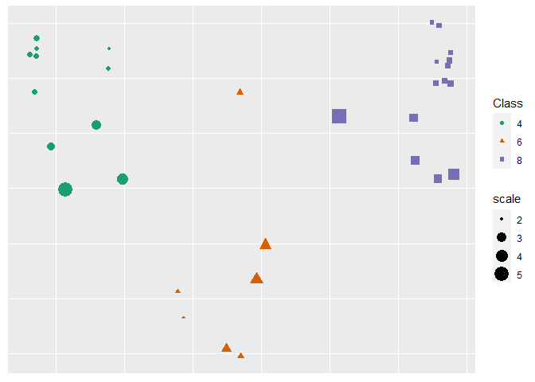

README.rmd
================
Jake S. Rhodes
4/4/2023

# RF-GAP

## Update:

\#\#\#Random Forest Geometry- and Accuracy-Preserving proximities was
accepted for publication on March 26, 2023. An updated link will soon be
provided.

## Random Forest Geometry- and Accuracy-Preserving proximities

This is the official repository for the paper “Random Forest- Geometry-
and Accuracy-Preserving Proximities”
(<https://arxiv.org/abs/2201.12682>). In the paper we show that random
forest (RF) predictions can be exactly determined by using RF-GAP
proximities as weights in a weighted-sum regressor or weighted-majority
vote classifier. This repo provides the base code to generate the
various proximity definitions described in the paper.

## Generate RF-GAP proximities:

Random forests are capable of making predictions on both continuous and
categorical response variables for regression and classification,
respectively. Additionally, random forests handle mixed feature
variables, that is, predictor variables may be either numeric or
categorical and since the partitioning decisions are rank-based,
numerical predictor variables do not need to be normalized or
standardized as is typical in other machine learning contexts. Thus, the
construction of random forest-based proximities does not require the
same preprocessing steps as may be needed for other ML processes. This
simplifies the use of random forests and thus, for our purposes, the
generation of random forest proximities.

Let `x` be a dataframe or matrix object with labels `y`. Here `y` must
be numeric (for a regression forest) or a factor type (for a
classification task). If `y` is a character vector it will be coerced to
be a factor type. To generate the proximities, we use the
`get_proximities` function. The user may use a pre-trained random forest
to construct the proximities, which has the benefit of a direct
comparison of proximity types, or to train when calling
`get_proximities`.

``` r
library(rfgap)

# Defining the data and labels
x <- iris[, 1:4]
y <- iris[, 5]

# Generating the proximities
prox <- get_proximities(x, y)
```

This is the simplest way to generate proximities. Here we simply call
`get_proximities` using the dataframe `x` and labels `y` as inputs. By
default, RF-GAP proximities are constructed. The argument allows the
user to select the type of proximities to be constructed, the package
currently supports `"original"`, `"oob"`, and `"rfgap"`.

The user may train a random forest prior to calling `get_proximities`.
In this case, the user must train the `ranger` forest with the options
`keep.inbag` and `write.forest` set to `TRUE`. Using a pre-trained
forest allows the user to fairly compare different proximity types
without the need of retraining a forest each time.

    library(rfgap)

    # Defining the data and labels
    x <- iris[, -5]
    y <- iris[, 5]

    # Training the random forest
    rf <- ranger(x = x, y = y, keep.inbag = TRUE, write.forest = TRUE, seed = 42)

    # Constructing three sets of proximities
    proximities_rfgap <- get_proximities(x, rf = rf,
                                         type = 'rfgap')
                                         
    proximities_oob   <- get_proximities(x, rf = rf,
                                         type = 'oob')
                                         
    proximities_orig  <- get_proximities(x, rf = rf, 
                                         type = 'original')

`get_proximities` has the additional option for the user to supply a
test set. Including the test set will extend the proximities to the test
observations. This is done by using the argument `x_test`. The returned
proximity matrix will have *n*\_*t**r**a**i**n* + *n*\_*t**e**s**t* rows
and columns. The returned proximity matrix is an S3 object of type
`rf_proximities`. This object type has additional methods associated
with it for making predictions, producing visualizations, detecting
outliers, and imputing missing data.

## Create 2-dimensional MDS embedding using RF-GAP proximities and plot

``` r
x <- iris[, 1:4]
y <- iris[, 5]
mds <- rf_mds(x, y, type = 'rfgap')
```

    ## initial  value 16.292495 
    ## iter   5 value 8.497290
    ## iter  10 value 7.959656
    ## final  value 7.945167 
    ## converged

``` r
plot(mds, y)
```

<!-- -->

## Impute missing data

``` r
x <- airquality[, -4]
y <- airquality[, 4]
imputed_data <- rf_impute(x, y, type = 'rfgap')
```

## Run Outlier Detection

``` r
x <- mtcars[, -c(1, 2)]
y <- as.factor(mtcars[, 2])
outlier_scores <- rf_outliers(x, y, type = 'rfgap')

plot(outlier_scores, x, y)
```

    ## initial  value 16.291417 
    ## iter   5 value 13.131588
    ## iter  10 value 12.117763
    ## iter  15 value 11.540716
    ## iter  20 value 11.305680
    ## iter  25 value 11.219902
    ## iter  25 value 11.210208
    ## iter  25 value 11.199484
    ## final  value 11.199484 
    ## converged

<!-- -->
